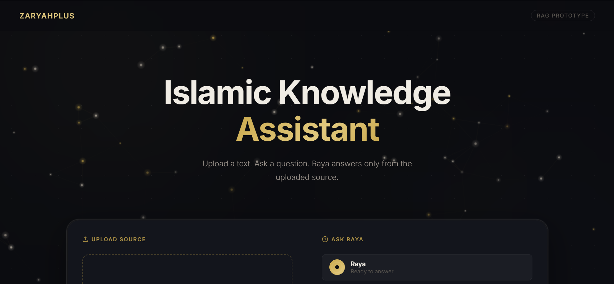
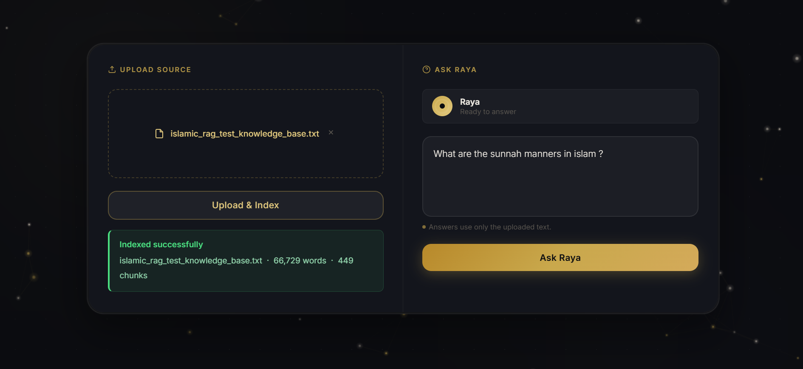
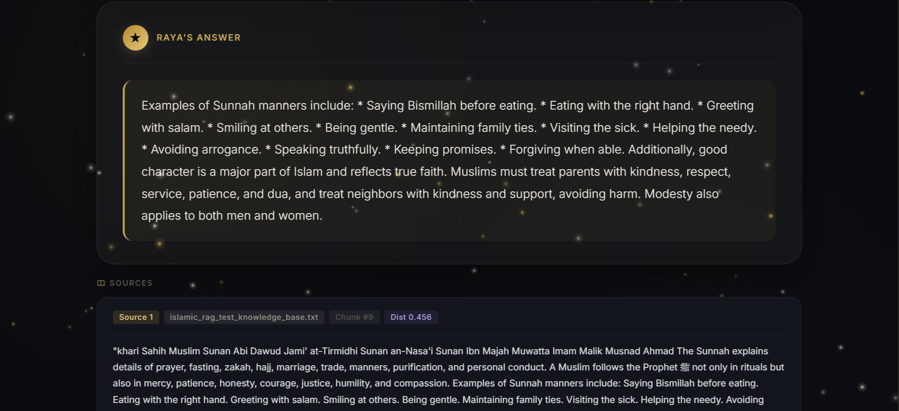

# ZaryahPlus Islamic Knowledge Assistant — RAG Prototype

## Project Screenshots

<p align="center">
  
</p>

<p align="center">
  
</p>

<p align="center">
  
</p>

---

## Description
A plain HTML/CSS/JS + FastAPI RAG prototype where users upload Islamic .txt texts and ask questions. The system retrieves relevant passages using embeddings and ChromaDB, then Gemini answers only from the retrieved passages.

## Tech Stack
- FastAPI
- Python
- sentence-transformers
- all-MiniLM-L6-v2
- ChromaDB
- Gemini API
- HTML/CSS/JavaScript
- Fetch API

## Features
- Upload .txt Islamic text
- Automatic chunking
- Embedding generation
- Local vector storage with ChromaDB
- Semantic retrieval
- Gemini answer generation
- Strict answer-only-from-source prompt
- Source passages shown with answers
- Rejects unrelated questions
- Premium frontend UI

## Setup Instructions (Clean Machine)

**Step 1: Clone repo**
```powershell
git clone <your-repo-url>
cd islamic-rag-assistant
```

**Step 2: Create virtual environment**
```powershell
python -m venv .venv
.\.venv\Scripts\activate
```

**Step 3: Install requirements**
```powershell
pip install -r backend/requirements.txt
```

**Step 4: Create backend/.env**
Copy the example file to create your environment variables:
```powershell
copy backend\.env.example backend\.env
```

**Step 5: Add Gemini API key**
Open `backend/.env` and replace the placeholder with your actual Gemini API key.

**Step 6: Run backend**
```powershell
cd backend
..\.venv\Scripts\uvicorn main:app --host 127.0.0.1 --port 8001
```

**Step 7: Open frontend**
Open `frontend/index.html` in your web browser, or use the provided `start.bat` script from the project root to launch both the backend and frontend servers simultaneously.

## API Endpoints
- `GET /` - Health check
- `POST /upload` - Uploads, chunks, embeds, and stores a .txt file into ChromaDB
- `POST /query` - Queries the vector database and generates a restricted LLM response

## Testing Examples
1. Upload `sample_texts/salah_sample.txt`
2. Ask: **How many times a day do Muslims pray?**
3. Ask: **What does the text say about patience?**
4. Ask: **Who built the Kaaba?**

*Expected not-found answer for the Kaaba question:*
"I could not find relevant information about this in the uploaded text."

---

## Project Explanations

### What is RAG?
Retrieval-Augmented Generation (RAG) is a technique that gives an AI system external, customized documents to use as context before it generates an answer. This grounds the AI's responses in fact and drastically reduces hallucinations.

### What are Embeddings?
Embeddings are numerical representations (lists of numbers) of text. They capture the semantic meaning of a word, sentence, or paragraph. By comparing the numbers, the system can mathematically determine which passages are most similar in meaning to a user's question.

### What does ChromaDB do?
ChromaDB is a specialized local vector database. It stores the text chunks alongside their numerical embeddings. When a question is asked, ChromaDB quickly searches thousands of chunks to find the ones closest in meaning to the question's embedding.

### Why are source passages shown?
Showing source passages creates transparency and trust. The user can verify that the AI isn't hallucinating or pulling from external training data, but is strictly interpreting the exact document that was uploaded.

### Why must the LLM not answer from general knowledge?
The goal of a strict RAG system is to be a faithful assistant to the uploaded texts. If it answers using its general knowledge, it defeats the purpose of uploading a specific document, and opens the door for uncontrolled, unsourced, or potentially inaccurate hallucinations.
